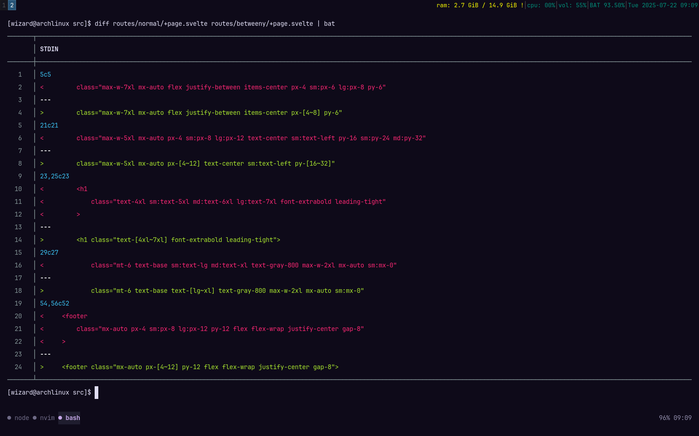

# 🪄 tw-betweeny

A Tailwind CSS plugin that adds support for fluid, clamped values using `~` notation. Perfect for modern responsive designs where values scale between a `min` and `max` depending on viewport width.

## 🤔 Okay but what does that even mean?

Normally in Tailwind, you'd do stuff like:

```html
<div class="px-4 sm:px-8 lg:px-12">...</div>
```

You're manually defining values at multiple breakpoints just to make things scale nicely.

With **tw-betweeny**, you can simply write:

```html
<div class="px-[4~12]">...</div>
```

And boom; it smoothly scales between `1rem` (4) and `3rem` (12) based on the viewport width. No breakpoints. No extra classes. Just chill.

---

### ⚙️ Behind the Scenes

* Plugin assumes your min viewport is `320px` and max is `1600px` by default. ( You may change this in the source-code itself. `./tw-betweeny.ts` line `3`).
* It auto-generates a `clamp()` CSS function
* Every screen size in between is fluidly handled

> Define the smallest screen value → define the largest → **done**
>
> No need to micromanage every breakpoint anymore.

---

# The Plugin In Action:




## 📐 Supported Utilities

| Prefix                           | CSS Output                      |
| -------------------------------- | ------------------------------- |
| `text`                           | `font-size`, auto `line-height` |
| `p`, `px`, `py`, `pt`, etc.      | `padding-*`                     |
| `m`, `mx`, `my`, `mt`, etc.      | `margin-*`                      |
| `w`, `h`, `min-w`, `max-w`, etc. | size props                      |
| `space-x`, `space-y`             | child spacing                   |

# Installation:

> [!NOTE]
> This assumes you are using tailwindcss `V4+` & this repo has an `input.css` and an `app.css` ( the output ), because I'm using the tailwindcss standalone binary. 

1. Just copy the `tw-betweeny.ts` file into your project
2. Put the following in your `input.css` or wherever your css file is if you aren't using the standalone binary:
```css
@import "tailwindcss";
@plugin "<path_to_tw-betweeny.ts>"
```
3. Enjoy.

> [!TIP]
> The repo shows an example of a sveltekit project using this plugin, so that you have a reference to port it into the framework of your liking.
